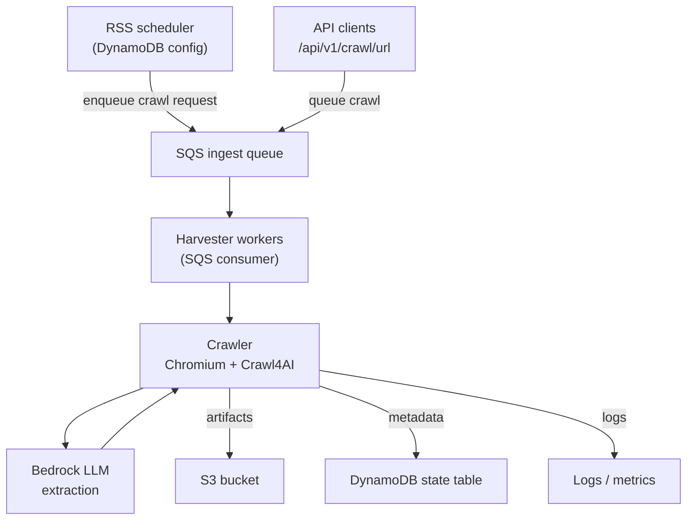

# Harvester at a Glance

The harvester is a news article collection and extraction system that automatically discovers, crawls, and processes web content from various news sources. Think of it as an intelligent web scraper that not only downloads articles but also understands and extracts structured information from them using AI.

## How the Harvester Works

The harvester operates through several coordinated components working together:

### 1. Authentication Management
The harvester maintains a fresh authentication token for AWS Bedrock (Amazon's managed AI service). Because Bedrock tokens expire after a certain period, a background task continuously monitors and refreshes this token before it becomes invalid. This ensures that when the crawler needs to call the AI model to extract article data, it always has valid credentials ready to use.

### 2. Work Discovery and Queueing
The system discovers work to do in two ways:
- **RSS Feed Monitoring**: It periodically checks DynamoDB for configured RSS feed sources
- **Direct API Requests**: It accepts one-off crawl requests through the REST API endpoint

Once a URL needs to be crawled (whether from an RSS feed or API request), the harvester places that crawl job into an AWS SQS (Simple Queue Service) queue. This queue acts as a reliable buffer between incoming requests and the actual crawling work.

### 3. Distributed Work Processing
A pool of worker processes continuously monitors the SQS queue for new crawl jobs. When a worker picks up a job, it:
- Launches a Chromium browser instance using Crawl4AI (a specialized web crawling framework)
- Navigates to the target URL and waits for the page to fully load
- Captures the complete page content, including any dynamically rendered JavaScript elements

### 4. AI-Powered Content Extraction
For each crawled page, the harvester uses AWS Bedrock's large language model (LLM) to intelligently extract structured information. Instead of relying on brittle CSS selectors or HTML parsing rules that break when websites change, the AI analyzes the page content and identifies:
- Article title
- Main article body text
- Publication date
- Relevant keywords and topics

This AI-driven approach is much more resilient to website layout changes and works across different news sites without custom configuration.

### 5. Storage and Tracking
After extraction, the harvester stores the results in multiple locations:
- **Raw artifacts** (HTML, PDF, extracted JSON) are saved to Amazon S3 for long-term storage
- **Metadata** (crawl status, timestamps, S3 paths, extraction results) is recorded in DynamoDB for fast querying
- **Processing records** are maintained in the local filesystem or S3, depending on configuration

This dual storage approach allows for both efficient searching (via DynamoDB) and complete historical archives (via S3).

## Understanding AWS Bedrock's Role

AWS Bedrock serves as the intelligence layer of the harvester, transforming raw HTML into meaningful, structured data.

### How It Works
When Crawl4AI fetches a webpage, it receives potentially thousands of lines of HTML, CSS, and JavaScript. Rather than writing complex parsing logic for each different news website, the harvester sends this raw content to Bedrock's large language model along with specific instructions about what information to extract.

The LLM reads through the page content just like a human would, identifying the article's key components regardless of how the HTML is structured. This is accomplished through Crawl4AI's `LLMExtractionStrategy`, which:
1. Formats the page content into a prompt for the AI model
2. Specifies the exact data schema we want (title, body, date, keywords)
3. Sends the request to Bedrock using the configured model ID (such as Claude or another foundation model)
4. Receives back a structured JSON response with the extracted fields

### Token Management
Because AWS Bedrock requires authentication for each API call, and because these authentication tokens expire periodically, the harvester runs a dedicated background task that:
- Monitors the current token's expiration time
- Proactively requests a new token before the old one expires
- Shares this refreshed token across all concurrent crawl requests

This ensures that crawler workers never fail due to expired credentials, even during long-running batch operations.

## Scaling the Harvester

Understanding how to scale the harvester is important as your crawling needs grow. The architecture uses several AWS services, each with different scaling characteristics.

### The SQS Queue as a Buffer
Amazon SQS acts as a shock absorber between incoming crawl requests and the workers that process them. When you receive a sudden burst of articles to crawl (perhaps a dozen RSS feeds all updated at once), SQS reliably holds all these jobs until workers are available to process them.

To increase throughput, you have several options:
- **Add more harvester containers**: Deploy additional instances of the harvester application, and each will independently consume messages from the shared SQS queue
- **Increase concurrency per process**: The current implementation uses a semaphore that limits each harvester process to one crawl at a time. You can adjust this semaphore to allow multiple concurrent crawls per process, though you'll need to ensure your server has sufficient memory and CPU to run multiple Chromium instances simultaneously
- **Hybrid approach**: Run multiple containers with moderate concurrency settings for each

### Storage Services
It's important to understand that S3 and DynamoDB don't automatically scale up just because your SQS queue is growing. These are managed services that handle scaling internally, but you still need to:
- **Monitor DynamoDB**: Watch for throttling errors and adjust read/write capacity if using provisioned mode (or use on-demand mode for automatic scaling)
- **Monitor S3**: While S3 itself scales automatically, you should watch for rate limiting if you're writing thousands of objects per second to the same prefix
- **Watch costs**: As throughput increases, so do your AWS bills for storage, data transfer, and DynamoDB operations

## Monitoring and Debugging

The harvester provides several ways to observe what's happening and troubleshoot issues.

### Application Logs
The most direct way to see what the harvester is doing is through its logs:
- **Docker deployment**: Run `docker-compose logs -f harvester` to follow the logs in real-time
- **Local development**: The harvester outputs logs to your terminal as it runs

These logs show each crawl attempt, extraction results, errors, and background task activities.

### API Endpoints for Observability
The harvester exposes several HTTP endpoints that let you inspect its current state:

- **Queue status**: `GET /api/v1/sqs/status` shows how many messages are waiting in the queue and how many workers are active
- **Queue control**: Use `GET /api/v1/sqs/pause` to temporarily stop processing new messages (useful during maintenance) and `GET /api/v1/sqs/resume` to restart processing
- **Bedrock token**: `GET /api/v1/bedrock/token` returns the current authentication token (useful for debugging authentication issues, but should not be exposed in production)

### AWS Service Inspection
You can also directly query the underlying AWS services using the AWS CLI:

- **SQS**: `aws sqs receive-message --queue-url <your-queue-url>` lets you peek at pending messages without removing them from the queue
- **DynamoDB**: `aws dynamodb scan --table-name <your-table-name>` retrieves all crawl records (though for large tables, you should use query operations with specific filters)
- **S3**: `aws s3 ls s3://<your-bucket-name>/` shows all stored artifacts

These CLI commands are particularly useful when troubleshooting why certain articles didn't process correctly or when auditing what data the harvester has collected.

## Automated RSS Feed Monitoring

One of the harvester's key features is its ability to automatically monitor RSS feeds and discover new articles without manual intervention. This section explains how and why this works.

### Why RSS Feeds Are Stored in DynamoDB

News websites constantly publish new articles throughout the day. Rather than manually submitting each article URL for crawling, the harvester maintains a list of RSS feed URLs in DynamoDB. This approach offers several advantages:

- **Persistence**: Feed configurations survive application restarts and can be shared across multiple harvester instances
- **Dynamic updates**: You can add, remove, or modify feed configurations without redeploying the application
- **Metadata storage**: Each feed record includes not just the URL, but also associated tags (for categorization), limits (maximum articles to fetch per check), and other settings
- **Queryability**: DynamoDB allows fast lookups and updates of feed configurations

### How the RSS Scheduler Works

The harvester runs a background scheduler that operates on a fixed interval (approximately every 10 minutes). Here's what happens during each cycle:

1. **Read feed configurations**: The scheduler queries DynamoDB to retrieve all configured RSS feeds. Each record contains:
   - The RSS feed URL (e.g., `https://example.com/feed.xml`)
   - Tags to apply to articles from this source (e.g., `["technology", "AI"]`)
   - Maximum number of articles to process per check
   - Last check timestamp (to avoid reprocessing old articles)

2. **Fetch each feed**: For every configured feed, the scheduler makes an HTTP request to fetch the RSS XML. RSS feeds are standardized XML documents that list recent articles with their URLs, titles, and publication dates.

3. **Identify new articles**: The scheduler parses the RSS XML and extracts article URLs. It compares these against previously processed articles (tracked in DynamoDB) to identify which ones are new.

4. **Create crawl jobs**: For each new article URL, the scheduler creates a crawl request message containing:
   - The article URL to crawl
   - Source tags from the feed configuration
   - Any additional metadata

5. **Enqueue for processing**: These crawl request messages are sent to the SQS queue, where they wait to be picked up by harvester workers (the same workers that process API-submitted crawl requests).

### Setting Up RSS Feed Configurations

There are two ways to configure which RSS feeds the scheduler should monitor:

1. **API endpoint**: Send a POST request to `/api/v1/crawl/rss` with the feed URL, tags, and limits. This creates a new record in DynamoDB.

2. **Bulk import**: The harvester includes a helper script that reads `harvester/harvester_scrape_config.json` (a JSON file containing multiple feed configurations) and imports all of them into DynamoDB at once. This is useful for initial setup or when migrating configurations.

### Why Periodic Checking Is Necessary

RSS feeds don't "push" notifications when new content is published. Instead, the harvester must periodically "pull" (fetch) each feed to check for updates. The 10-minute interval balances two concerns:
- **Timeliness**: New articles are discovered relatively quickly (within 10 minutes of publication)
- **Resource usage**: Fetching feeds too frequently wastes bandwidth and AWS resources, especially if feeds rarely update

If you need more frequent updates for critical sources, you can adjust the scheduler interval in the harvester configuration. Conversely, for low-priority feeds that update infrequently (e.g., weekly blogs), you might consider a longer interval.

### Other Scheduled Tasks

The RSS scheduler is currently the only periodic background job in the harvester. Other background tasks (like Bedrock token refresh) run continuously but only perform work when needed (e.g., when a token is about to expire) rather than on a fixed schedule.

## Process Diagram

