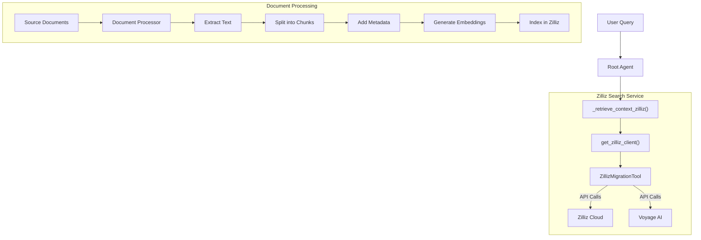

# Zilliz Embedding & Retrieval Architecture

## Overview

This document outlines the architecture of the Zilliz embedding and retrieval system for the Policy Pulse application. The system uses Voyage AI for generating embeddings and Zilliz Cloud for vector storage and semantic search.

## Component Diagram



## Component Diagram

```mermaid
graph TD
    A[Start: Initialize<br/>ZillizIndexingTool<br/>API Keys: Voyage, OpenAI, Zilliz] --> B[Create/Check Collection<br/>Schema + Indexes + BM25 Function]
    
    B --> C{For Each<br/>Document File}
    
    C -->|Process File| D[1. Extract Text<br/>PDF/DOCX/TXT/MD]
    
    D --> E[2. Split into Chunks<br/>RecursiveCharacterTextSplitter<br/>1000 chars, 200 overlap]
    
    E --> F[3. Enrich Each Chunk<br/>• OpenAI: chunk_summary<br/>• Extract: keywords, section_title<br/>• Add: filename, file_hash, metadata]
    
    F --> G[4. Create Enriched Text<br/>Original + Summary + Context + Keywords]
    
    G --> H[5. Generate Embeddings<br/>Voyage AI: voyage-3-large<br/>1024-dim vectors]
    
    H --> I[6. Upsert Chunks to Zilliz<br/>Batch insert: chunks + vectors + metadata<br/>Auto-generates BM25 sparse vectors]
    
    I -->|More Files?| C
    
    C -->|Done| J[Complete<br/>Collection loaded & indexed<br/>Ready for search]
    
    style A fill:#e1f5e1
    style B fill:#fff4e6
    style C fill:#e3f2fd
    style D fill:#fce4ec
    style E fill:#fce4ec
    style F fill:#fce4ec
    style G fill:#fff9c4
    style H fill:#f3e5f5
    style I fill:#e0f2f1
    style J fill:#e1f5e1
    end
```

## Core Components

### 1. ZillizMigrationTool

Central class managing vector database operations:

```python
class ZillizMigrationTool:
    def __init__(self, voyage_api_key, zilliz_uri, zilliz_token, openai_api_key=None):
        self.voyage_client = voyageai.Client(api_key=voyage_api_key)
        self.zilliz_client = MilvusClient(uri=zilliz_uri, token=zilliz_token)
        # Basic document processor initialization
        self.document_processor = None
        if openai_api_key:
            from zilliz_embedding import DocumentProcessor
            self.document_processor = DocumentProcessor(openai_api_key)
```

### 2. DocumentProcessor

Handles document processing, chunking, and enrichment:

```python
class DocumentProcessor:
    def __init__(self, openai_api_key):
        self.text_splitter = RecursiveCharacterTextSplitter(
            chunk_size=2000, chunk_overlap=400, length_function=len)
        self.llm = ChatOpenAI(model="gpt-3.5-turbo", 
                             temperature=0.0,
                             api_key=openai_api_key)
```

### 3. Client Caching

Uses lru_cache for efficient client reuse:

```python
@lru_cache(maxsize=1)
def _get_cached_zilliz_client():
    return ZillizMigrationTool(
        voyage_api_key=os.getenv("VOYAGE_API_KEY"),
        zilliz_uri=os.getenv("ZILLIZ_CLOUD_URI"),
        zilliz_token=os.getenv("ZILLIZ_API_KEY"),
        openai_api_key=os.getenv("OPENAI_API_KEY")
    )
```

## Document Processing Pipeline

### 1. Text Extraction

Extracts content from various file formats:

```python
def extract_text_from_file(self, file_path):
    """Extract text from PDF, DOCX, TXT files"""
    if file_path.suffix.lower() == '.pdf':
        return self._extract_from_pdf(file_path)
    elif file_path.suffix.lower() == '.docx':
        return self._extract_from_docx(file_path)
    # Other formats...
```

### 2. Chunking

Splits documents into manageable, semantic chunks:

```python
def process_file(self, file_path):
    text = self.extract_text_from_file(file_path)
    chunks = self.text_splitter.split_text(text)
    # Process chunks with metadata...
```

### 3. Enrichment

Adds valuable metadata to enhance search:

```python
# Add metadata to chunks
chunk = {
    "id": chunk_id,
    "text": chunk_text,
    "filename": file_path.name,
    "section_title": section_title,
    "document_summary": document_summary,
    "semantic_keywords": self.extract_keywords(chunk_text)
}
```

### 4. Vector Generation

Creates embeddings for semantic search:

```python
def generate_embeddings(self, texts, show_progress=True):
    batches = [texts[i:i + BATCH_SIZE] for i in range(0, len(texts), BATCH_SIZE)]
    for batch in batches:
        response = self.voyage_client.embed(
            batch, model="voyage-3-large", input_type="document")
        # Process response...
```

### 5. Indexing

Stores documents and vectors in Zilliz:

```python
def insert_chunks(self, collection_name, chunks, show_progress=True):
    # Prepare data with embeddings
    enriched_texts = [self._create_enriched_embedding_text(c) for c in chunks]
    embeddings = self.generate_embeddings(enriched_texts, show_progress)
    # Insert into Zilliz...
```

## Search Capabilities

### 1. Semantic Search

Pure vector similarity search:

```python
def search_chunks(self, collection_name, query, limit=5, metadata_filter=None):
    query_embedding = self.voyage_client.embed([query], model="voyage-3-large").embeddings[0]
    # Perform search with embeddings...
```

### 2. Hybrid Search

Combines vector search with keyword matching:

```python
def hybrid_search_chunks(self, collection_name, query, limit=5, metadata_filter=None):
    # Extract keywords from query
    keywords = [word for word in query.split() if len(word) > 3]
    # Combine semantic and keyword search...
```

## Recommended Improvements

### 1. Lazy Loading for Document Processor

```python
def __init__(self, voyage_api_key, zilliz_uri, zilliz_token, openai_api_key=None):
    self.voyage_client = voyageai.Client(api_key=voyage_api_key)
    self.zilliz_client = MilvusClient(uri=zilliz_uri, token=zilliz_token)
    self._openai_api_key = openai_api_key
    self._document_processor = None

@property
def document_processor(self):
    """Lazy-loaded document processor - only created when needed."""
    if self._document_processor is None and self._openai_api_key:
        from zilliz_embedding import DocumentProcessor
        self._document_processor = DocumentProcessor(self._openai_api_key)
    return self._document_processor
```

Benefits:
- Only loads document processor dependencies when needed
- Search operations remain lightweight
- Heavy dependencies (docx, pdfplumber, OpenAI) only loaded for ingestion

### 2. Separation of Concerns

Consider separating indexing and search functionalities:
- `ZillizIndexer`: For document processing and indexing
- `ZillizSearchClient`: Lightweight client for search only

### 3. Enhanced Caching

Improve the current caching mechanism:
- Add semantic similarity for cache hits on similar queries
- Implement monitoring of cache performance

## Connection Management

### API Clients

- Both Zilliz and Voyage clients make stateless HTTP requests
- No persistent connections maintained between operations
- Services won't "shut down" clients after periods of inactivity

### Error Handling

The system implements several layers of resilience:

```python
try:
    # Attempt hybrid search with TEXT_MATCH filtering
    results = self.search_chunks(
        collection_name=collection_name,
        query=query,
        limit=limit,
        metadata_filter=combined_filter
    )
except Exception as e:
    # Fallback to semantic search
    results = self.search_chunks(
        collection_name=collection_name,
        query=query,
        limit=limit
    )
```

## Performance Considerations

1. **Batch Processing**
   - Documents are processed in batches to manage API rate limits
   - Embeddings are generated in batches (100 chunks per batch)

2. **Search Caching**
   - TTLCache implements time-based expiration (30 minutes)
   - Reduces repeated API calls for common queries

3. **Rate Limiting**
   - Time delays between batch API calls prevent throttling
   - Error handling includes empty embedding fallbacks
