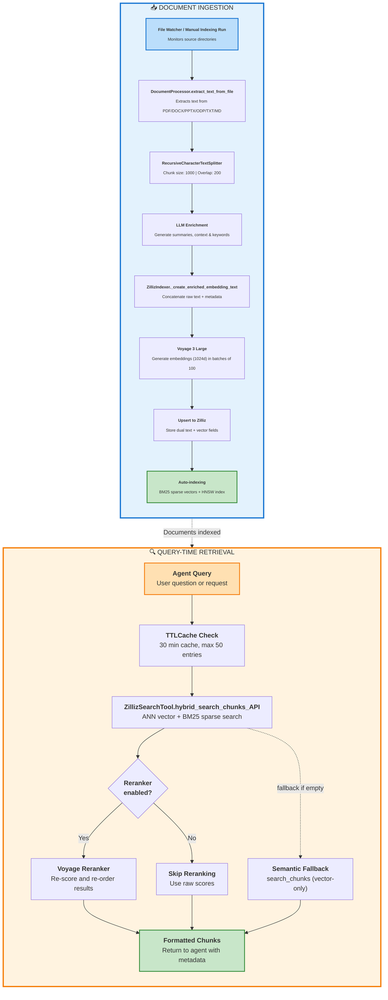

# Zilliz Embedding & Retrieval Architecture

## Overview

Policy Pulse uses Voyage AI for dense embeddings and Zilliz Cloud (Milvus) as the vector database. The architecture separates
document ingestion from query-time retrieval while sharing common clients via a factory module. Ingestion enriches every chunk
with LLM-generated context, keywords, and file metadata before storing both raw and enriched text variants to support dual
semantic/keyword search paths. Retrieval favors Zilliz's hybrid search pipeline with a semantic fallback, optional reranking,
and response caching for agents.

## High-Level Flow

## Core Modules

- **`Zilliz_src/doc_processor.py` – `DocumentProcessor`**: extracts text across PDF/DOCX/PPTX/ODP/TXT/MD formats, chunks content
  with a `RecursiveCharacterTextSplitter` (1000 size / 200 overlap), and uses an injected OpenAI client (`gpt-3.5-turbo` by
default) to generate summaries, section context, and keywords while calculating SHA-256 hashes for change detection.【F:Zilliz_src/doc_processor.py†L1-L114】
- **`Zilliz_src/indexer.py` – `ZillizIndexer`**: creates and manages Zilliz collections, generates enriched text, batches Voyage
  embeddings (`voyage-3-large`, 1024 dimensions), and upserts chunks with full metadata into dual text fields (`text` for display,
  `enriched_text` for search). It also persists processing logs and handles rename-safe metadata updates.【F:Zilliz_src/indexer.py†L1-L366】【F:Zilliz_src/indexer.py†L400-L644】
- **`Zilliz_src/search.py` – `ZillizSearchTool`**: performs hybrid retrieval via Zilliz's API (combining ANN vector search and BM25
  sparse search on `enriched_text`) with optional Voyage reranking, exposes semantic search, and standardizes output fields for
  agents.【F:Zilliz_src/search.py†L1-L221】
- **`Utils/client_factory.py`**: centralizes creation of Voyage, Milvus, OpenAI, and optional Voyage reranker clients so that
  ingestion and retrieval share consistent credentials and retry settings.【F:Utils/client_factory.py†L1-L64】
- **`Zilliz_src/file_watcher.py`**: monitors source directories, debounces events, uses stored file hashes to avoid reprocessing,
  and coordinates reindexing or deletion through `ZillizIndexer` when files change, move, or are removed.【F:Zilliz_src/file_watcher.py†L1-L171】
- **`agents/policy_pulse_agent/tools.py`**: exposes `_retrieve_context_zilliz` to agents, caching results in a shared
  `TTLCache`, instantiating search clients via `get_zilliz_client`, and orchestrating hybrid search with semantic fallback.【F:agents/policy_pulse_agent/tools.py†L1-L111】【F:agents/policy_pulse_agent/tools.py†L432-L524】

## Document Ingestion Pipeline

1. **Source Monitoring & Change Detection**
   - Continuous runs use `file_watcher.py`, which filters supported extensions and schedules work after a debounce window.
   - For updates, it hashes the file, compares against stored `file_hash` metadata, and only reprocesses when content changes;
     rename events trigger metadata updates without re-embedding when hashes match.【F:Zilliz_src/file_watcher.py†L32-L171】【F:Zilliz_src/indexer.py†L560-L644】

2. **Extraction & Chunking**
   - `DocumentProcessor.extract_text_from_file` routes to type-specific extractors with OCR fallback for scanned PDFs and support
     for PPTX/ODP. The recursive splitter produces overlapping 1000-character chunks, enabling contextual overlap.【F:Zilliz_src/doc_processor.py†L25-L114】

3. **Metadata Enrichment**
   - Each chunk carries summaries (`chunk_summary`, `document_summary`), section context, flattened keyword text for TEXT_MATCH,
     original file metadata, and derived hashes/sizes to support lifecycle management.【F:Zilliz_src/indexer.py†L200-L324】【F:Zilliz_src/indexer.py†L420-L511】

4. **Enriched Text Construction**
   - `_create_enriched_embedding_text` concatenates raw chunk text with metadata (summary, context, keywords, file info), creating
     a search-focused payload that powers both embeddings and keyword search consistency.【F:Zilliz_src/indexer.py†L308-L338】

5. **Embedding Generation & Logging**
   - Embeddings are produced in batches of 100 via Voyage's `voyage-3-large` model; errors fall back to zero vectors while logging
     warnings. Each processed chunk is recorded with enrichment stats for auditability.【F:Zilliz_src/indexer.py†L366-L417】【F:Zilliz_src/indexer.py†L340-L404】

6. **Collection Schema & Indexing**
   - `create_collection` defines VARCHAR `id` primary keys, display (`text`) and search (`enriched_text`) fields, BM25 sparse
     vectors auto-generated from `enriched_text`, flattened `keywords_text`, structured metadata, and an HNSW index for the dense
     vector field. Inverted indexes enable TEXT_MATCH across multiple fields.【F:Zilliz_src/indexer.py†L214-L306】

7. **Upsert & Lifecycle Operations**
   - `insert_chunks` batches upserts to Zilliz, ensuring enriched text, embeddings, and metadata stay aligned. When files are
     renamed, `update_chunks_metadata` reuses embeddings by only updating display metadata, keeping vector consistency.【F:Zilliz_src/indexer.py†L418-L644】

## Query-Time Retrieval

1. **Client Caching**
   - `get_zilliz_client` leverages an `lru_cache` to share Voyage, Milvus, and optional reranker clients across agent calls,
     minimizing cold-start latency while respecting API key reuse.【F:agents/policy_pulse_agent/tools.py†L25-L63】

2. **Hybrid Search First**
   - `_retrieve_context_zilliz` invokes `ZillizSearchTool.hybrid_search_chunks_API`, which issues a hybrid request combining ANN
     vector search (COSINE on the `vector` field) and BM25 sparse search on `enriched_text`, optionally using Zilliz's RRF fusion
     and reranking twice the requested results when a reranker is configured.【F:Zilliz_src/search.py†L112-L221】【F:agents/policy_pulse_agent/tools.py†L432-L493】

3. **Semantic Fallback**
   - If hybrid results are empty, the tool calls `search_chunks`, generating a query embedding (input type `query`) and returning
     cosine similarity scores alongside both text fields for downstream reasoning.【F:Zilliz_src/search.py†L132-L208】【F:agents/policy_pulse_agent/tools.py†L469-L501】

4. **Optional Voyage Reranker**
   - When `RERANKER_ENABLED` is true and a client is available, the search tool fetches double the desired hits, reranks them via
     Voyage's reranker client, and trims to the requested limit, improving ordering for dense + sparse blends.【F:Utils/client_factory.py†L52-L87】【F:Zilliz_src/search.py†L65-L117】

5. **Response Formatting & Caching**
   - Results are normalized to include `text`, `enriched_text`, source filename, and scores. `_retrieve_context_zilliz` caches
     responses per query/collection key using a 30-minute TTLCache (max 50 entries) and flags cached responses for observability.【F:agents/policy_pulse_agent/tools.py†L432-L524】

## Operational Considerations

- **Batching & Rate Limiting**: Embedding generation sleeps between batches to avoid Voyage throttling; API failures record
  structured warnings while preserving positional alignment of chunks and embeddings.【F:Zilliz_src/indexer.py†L366-L417】
- **Logging & Auditing**: Each indexing run outputs JSON logs summarizing enrichment ratios, processed files, and chunk counts to
  `embedding_logs/`, supporting post-run diagnostics.【F:Zilliz_src/indexer.py†L324-L369】
- **Schema Trade-offs**: Maintaining separate `text` and `enriched_text` fields allows clean UI display while keeping search and
  embeddings aligned; stale metadata within `enriched_text` is tolerated to avoid unnecessary re-embedding after renames.【F:Zilliz_src/indexer.py†L214-L338】【F:Zilliz_src/indexer.py†L560-L644】
- **Automation Hooks**: The file watcher can run continuously for incremental updates, while manual indexing scripts reuse the
  same clients, ensuring consistent embeddings between batch and real-time operations.【F:Zilliz_src/file_watcher.py†L1-L171】【F:Zilliz_src/indexer.py†L590-L644】
