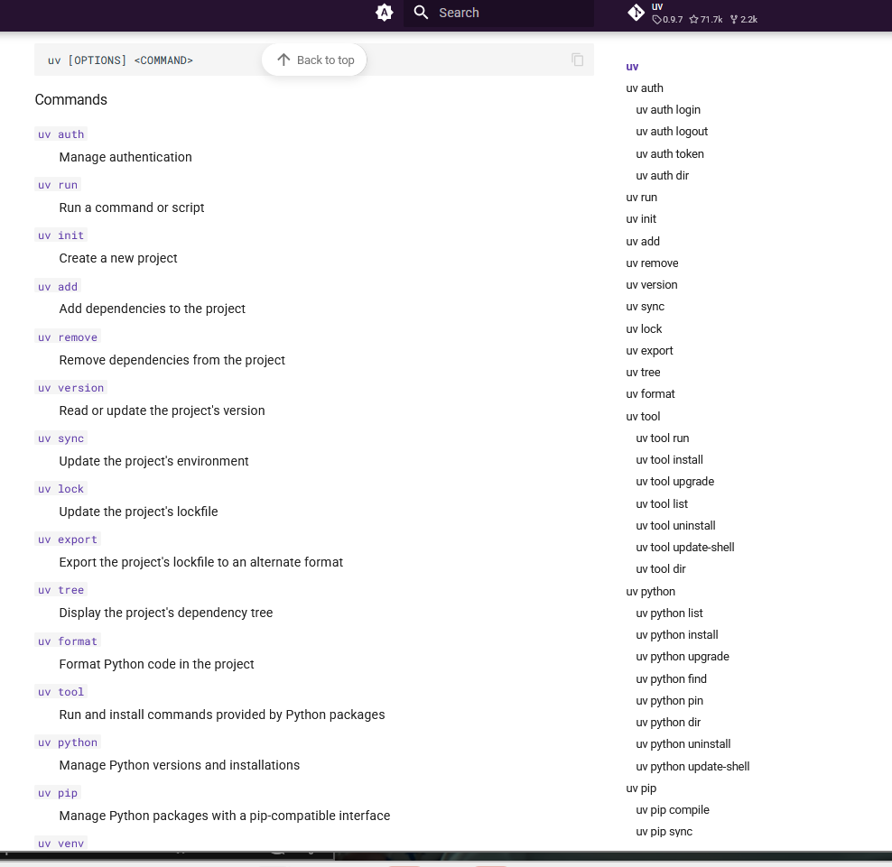

# instructions for using uv for new users

pip install uv
uv venv .venv
source .venv/bin/activate

uv pip compile pyproject.toml --output-file requirements.txt
uv pip sync requirements.txt

 python agents/policy_pulse_agent/agent.py

# The official uv reference
 https://docs.astral.sh/uv/reference/cli/#uv-auth-logout

 

find -name "*.py" -not -path "./.venv/*" | xargs wc -l # this returns the number of lines of python code in the repo split by file 